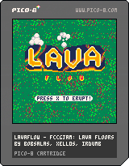

Lavaflow

Accreditation to:
	-Jasper Danan
	-Chovin Carlson
	-Johnny Quitugua
	-Free Code Camp Guam

Experience Breakdown:
The Lavaflow project began as a simple game jam hosted by Chovin Carlson which later turned into a challenge over the course of the 2017 Spring Break.

Free Code Camp Guam made the challenge for themselves to try and create a game using the Pico-8 Game Editor over the course of one week.

Although they were unable to fulfil their original deadline by a few hours, the team completed the game nonetheless.

It was an absolutely awesome ride, especially since, for many, this was their first time using Pico-8 and using the programming language of Lua.

Result Summary:
The Game is a procedurely generated map runner, where you play as a flow of lava. The goal of the lava is to traverse the terrain while not being slowed down by giant boulders. You may hit a rock three times before receiving a game over with a final total time score.

The game is tile based and uses simple controls. The further and longer you last in the game, the faster the maprate increases.

The game is a fun, simple scroller, and is meant for the sake of passing time and enjoyment, and was created to better ourselves in coding and game development.

Notes:
If you would like to know more about this project, then you can check us out at Free Code Camp Guam here: https://www.facebook.com/groups/free.code.camp.Guam/

You can also look into Pico-8 to start your own game development here: http://www.lexaloffle.com/pico-8.php

